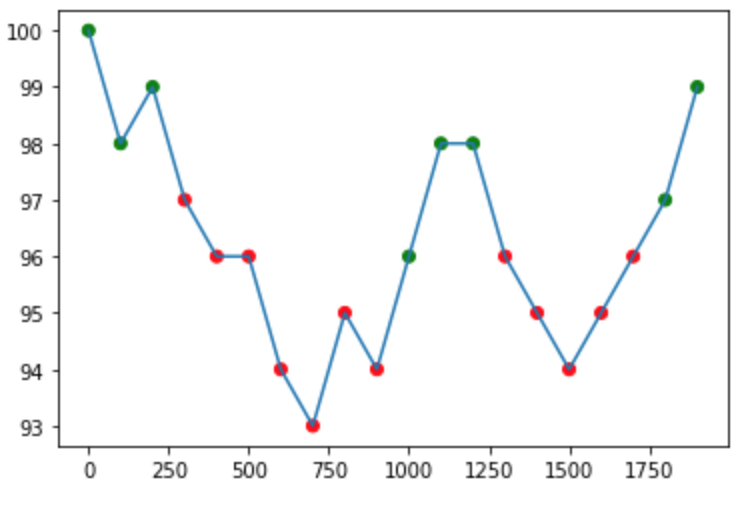

# 
Week 4 Assignments

### 
Henry Jones

# Tasks

- [X] Normalize Vector using Reduce
- [X] Vector Mean
- [X] Vector Standard Deviation
- [X] Line of Sight

# Observations and Measures

## Normalize Vector

For my normalization algorithm I was able to strip a lot of 'junk' I needed to get other MPI methods working away from my previous code. I wrote `parallel_integer_ss()` and `parallel_double_ss()` with calls to `MPI_Allreduce()` which both calculate SS in similar ways. I didn't end up seeing much speedup with this method over my previous data (from week 3) where i observed a speedup of 1.4999562.

For my tests I tried vectors with `size = 10,000,000` on 4 and 1 processes, times detailed below in seconds.

| MPI_Normalize_Vector | #1       | #2       | #3       | #4       | #5       | Average (mean)
|----------------------|----------|----------|----------|----------|----------|----------------------|
| One Process          | 0.204073 | 0.191399 | 0.189958 | 0.193028 | 0.191665 | 0.1940246 |
| 4 Processes          | 0.279422 | 0.286282 | 0.284132 | 0.287184 | 0.291430 | 0.28569   |

Speedup (4 cores): 0.6791438272

## Vector Mean

Vector mean was the most simple for me, I used a single `MPI_reduce()` in order to sum the partial sums from non-root nodes and had node 0 divide out `sum(X[i])/N` to get the mean.

For my tests I tried vectors with `size = 1,000,000,000` on 4 and 1 processes, times detailed below in seconds.

| MPI_Vector_Mean | #1        | #2        | #3        | #4        | #5        | Average (mean)
|-----------------|-----------|-----------|-----------|-----------|-----------|----------------------|
| One Process     | 15.303540 | 12.559255 | 11.852646 | 11.336006 | 11.804202 | 12.5711298 |
| 4 Processes     | 3.957062  | 2.958990  | 2.895106  | 2.877103  | 3.104518  | 3.1585558 |

Speedup (4 cores): 3.980024604915956

## Vector Standard Deviation

For vector standard deviation I utilized both `MPI_Allreduce()` and `MPI_reduce()` to commmunicate. First `MPI_Allreduce()` is used to distrubute the sum of all values to all nodes. Then, after a partial sum of squares is generated one each node `MPI_reduce()` is used to accumulate the global sum of squares which is opperated on by node 0 to get the actual standard deviation.

For my tests I tried vectors with `size = 1,000,000,000` on 4 and 1 processes, times detailed below in seconds.

| MPI_Vector_STD | #1        | #2        | #3        | #4        | #5        | Average (mean)
|----------------|-----------|-----------|-----------|-----------|-----------|----------------------|
| One Process    | 20.291070 | 18.061919 | 17.615132 | 17.613494 | 19.075581 | 18.5314392 |
| 4 Processes    | 4.408949  | 4.373965  | 5.069144  | 5.023227  | 4.356653  | 4.6463876 |

Speedup (4 cores): 3.988354135586967

## Line of Sight

For line of sight I contributed all changes to my code as I did it my self. Timing was taken before data allocation and after all MPI calls running on my Mac.

| MPI_LOS     | #1       | #2       | #3       | #4       | #5       | Average (Mean) |
|-------------|----------|----------|----------|----------|----------|----------------|
| One Process | 0.000200 | 0.000226 | 0.000175 | 0.000167 | 0.000236 | 0.0002008 |
| 4 Processes | 0.000562 | 0.000521 | 0.000575 | 0.000552 | 0.000505 | 0.000543 |

Speedup (4 cores): .3697974217

